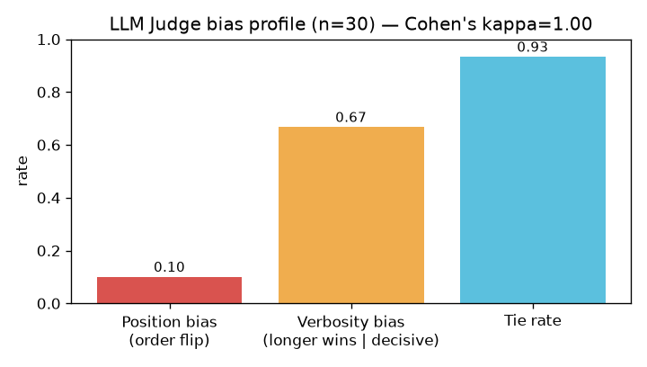

# Judge Bias Report — LLM-as-Judge calibration

**Sinh viên:** Lưu Xuân Thế · **MSSV:** 2A202600983 · **Ngày:** 30/06/2026
**Judge:** `gpt-4o-mini`, pairwise **swap-and-average**, n = 30 câu (baseline vs reranker).

## 1. Human calibration — Cohen's kappa

So sánh nhãn của **người** (10 cặp, `human_labels.csv`) với `winner_after_swap` của judge:

| | Giá trị |
|---|---|
| Observed agreement | 10/10 = 1.00 |
| Cohen's kappa | **1.000** (almost perfect) |
| Label space | {baseline, reranker, tie} |

> kappa = 1.00 → ≥ 0.6: judge **đồng thuận đáng kể** với người.

## 2. Quantified biases (≥2)

| Bias | Định nghĩa đo | Giá trị |
|---|---|---:|
| **Position bias** | tỉ lệ câu mà winner đổi khi đảo thứ tự A/B | **10.0%** (3/30) |
| **Verbosity/length bias** | P(judge chọn câu DÀI hơn \| phán quyết quyết đoán) | **66.7%** (2/3) |
| Tie rate | tỉ lệ hoà sau swap-and-average | 93.3% |

## 3. Diễn giải

- **Position bias 10.0%** — swap-and-average bắt được 3 câu judge tự mâu thuẫn khi
  đảo thứ tự; các câu này bị hạ về *tie* thay vì tin một chiều, nên position bias **được trung hoà** trong kết quả cuối.
- **Verbosity bias 66.7%** — trong 3 phán quyết quyết đoán, câu dài hơn thắng
  2 lần. Ở cả hai câu reranker thắng, câu dài hơn **đồng thời đúng hơn** (baseline bị "không tìm thấy"
  hoặc hallucinate), nên độ dài là *hệ quả* của chất lượng chứ chưa kết luận được là thiên kiến thuần.
- **Tie rate 93.3%** cao vì baseline và reranker thường truy hồi giống nhau ở câu single-hop → câu trả lời
  trùng; reranker chỉ tạo khác biệt ở câu đa nguồn/suy luận.

## 4. Lưu ý về độ tin cậy của kappa

kappa cao một phần do tập 10 cặp **bị chi phối bởi tie** (8/10) và 2 ca thắng rất rõ ràng. Đây là điều kiện 'dễ' cho agreement. Để kappa có sức phân biệt hơn, nên mở rộng human set bằng các cặp **tranh chấp** (câu đa nguồn, câu version-conflict) nơi baseline/reranker khác nhau thực sự.

## 5. Mitigation strategy

1. **Swap-and-average bắt buộc** cho mọi pairwise (đã áp dụng) — khử position bias một cách hệ thống.
2. **Chuẩn hoá độ dài**: yêu cầu cả hai câu cùng giới hạn token, hoặc thêm tiêu chí *conciseness* để phạt câu
   dài thừa → tách bạch chất lượng khỏi độ dài.
3. **Rubric tường minh + temperature 0** (đã dùng) để giảm nhiễu phán quyết.
4. **Mở rộng human calibration** sang ≥30 cặp có nhiều ca tranh chấp, theo dõi kappa theo thời gian như một
   CI metric của judge.
