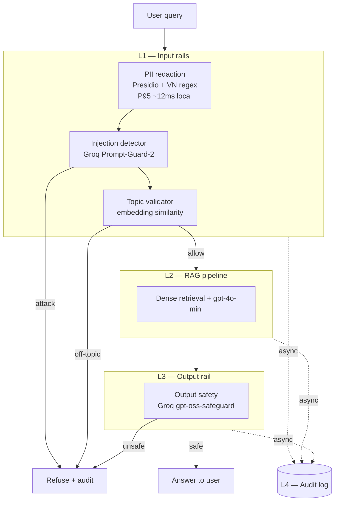

# Production Blueprint — RAG Evaluation & Guardrail Stack

**Sinh viên:** Lưu Xuân Thế · **MSSV:** 2A202600983 · **Ngày:** 30/06/2026
**Hệ thống:** Trợ lý RAG cho chính sách nhân sự nội bộ (tài liệu HR tiếng Việt).
**Models:** `gpt-4o-mini` (generation + judge + RAGAS), `text-embedding-3-small` (retrieval/topic),
Groq `llama-prompt-guard-2-86m` (injection), Groq `gpt-oss-safeguard-20b` (output safety),
Presidio + spaCy `en_core_web_lg` (PII).

---

## 1. Service Level Objectives (SLOs)

| # | Metric | Target (SLO) | Alert threshold | Severity | Nguồn đo |
|---|---|---:|---:|---|---|
| 1 | RAGAS faithfulness | ≥ 0.70 | < 0.65 trong 30′ | P2 | `phase-a/ragas_summary.json` |
| 2 | RAGAS answer_relevancy | ≥ 0.60 | < 0.50 trong 30′ | P2 | nt |
| 3 | RAGAS context_precision | ≥ 0.75 | < 0.65 trong 1h | P3 | nt |
| 4 | RAGAS context_recall | ≥ 0.75 | < 0.65 trong 1h | P3 | nt |
| 5 | Adversarial detection rate | ≥ 90% | < 80% mỗi release | P1 | `phase-c/adversarial_test_results.csv` |
| 6 | PII false-negative rate | 0% trên test PII | > 0% | P1 | `phase-c/pii_test_results.csv` |
| 7 | Output-guard unsafe detection | ≥ 90% | < 80% | P1 | `phase-c/output_guard_results.csv` |
| 8 | L1 PII latency P95 | < 50 ms | > 80 ms trong 5′ | P2 | `phase-c/latency_benchmark.json` |
| 9 | End-to-end latency P95 | < 3.5 s | > 4 s trong 5′ | P2 | nt |
| 10 | Judge–human Cohen's κ | ≥ 0.6 | < 0.5 | P3 | `phase-b/judge_bias_report.md` |

**Kết quả đo thực tế (run 30/06/2026):** faithfulness 0.734 ✅ · answer_relevancy 0.464 ⚠️ (dưới SLO — xem
playbook #2) · context_precision 0.795 ✅ · context_recall 0.854 ✅ · adversarial 90% ✅ · PII FN 0% ✅ ·
output unsafe detection 100% ✅ · κ = 1.0 ✅.

---

## 2. Kiến trúc Guard Stack (4 layer)

**Thứ tự rail:** PII → Injection → Topic (chặn ý đồ tấn công trước, rồi mới lọc phạm vi) → RAG → Output.
Fail-closed: bất kỳ rail nào trip đều trả về thông điệp từ chối lịch sự và ghi audit; **không** lộ lý do kỹ thuật cho user.

---

## 3. Latency budget & overhead (benchmark 100 requests)

Benchmark **100 requests** tuần tự + throttle 30 RPM (Groq free tier). Quyết định:
`allow=80, block_injection=6, block_offtopic=14` — chặn 100% input tấn công/ngoài phạm vi, cho qua 80 query HR hợp lệ.

| Layer | Công cụ | P50 | P95 | P99 | Đạt target? |
|---|---|---:|---:|---:|---|
| L1 PII | Presidio (local) | 7.8 ms | **11.9 ms** | 29 ms | ✅ < 50 ms |
| L1 total (PII+inject+topic) | + Groq/OpenAI | 320 ms | 366 ms | 1364 ms | ⚠️ remote-bound |
| L2 RAG | embed + gpt-4o-mini | ~0.9 s | ~1.6 s | ~2.0 s | — |
| L3 output | Groq safeguard | 428 ms | 1424 ms | 2810 ms | ⚠️ > 100 ms target |
| **End-to-end** | full stack | 1.65 s | **3.08 s** | 4.61 s | ✅ < 3.5 s (P95) |

**Guard overhead ≈ +1.79 s P95** (L1 input rails + L3 output rail) so với RAG-only.
**Honest note:** chỉ tầng **PII local** đạt P95 < 50 ms. Topic/injection/output là **lời gọi model từ xa**
(OpenAI embeddings, Groq classifiers) nên network-bound, không đạt mốc < 50 ms / < 100 ms. Hướng tối ưu
production: (a) self-host model guard distilled tại chỗ, (b) chạy các input rail **song song** thay vì nối tiếp,
(c) cache embedding topic, (d) gọi output-guard **streaming/async** chồng lấp với generation.

---

## 4. Alert Playbook (≥3 incidents)

### Incident #1 — Adversarial detection < 80% (P1)
- **Detection:** CI `eval-gate` hoặc mẫu tấn công production vượt ngưỡng.
- **Triage:** xuất các input lọt lưới từ `adversarial_test_results.csv`; phân loại (DAN / encoding / indirect…).
- **Mitigation:** hạ threshold Prompt-Guard (0.5→0.4), bổ sung rule cho category mới (base64/payload-split),
  thêm mẫu vào bộ adversarial, chạy lại benchmark FP để tránh over-block.
- **Rollback:** nếu over-block legit > 10%, khôi phục threshold cũ và chỉ thêm rule có ngữ cảnh.

### Incident #2 — answer_relevancy < 0.50 (P2) *(đang xảy ra, 0.464)*
- **Detection:** RAGAS daily eval.
- **Triage:** lọc bottom-10 `ragas_results.csv`; cluster theo `evolution_type` — hiện **multi_context** kéo điểm.
- **Mitigation:** bật **reranker** + **query decomposition** cho câu đa vế (đã chứng minh ở Phase B reranker
  thắng/không thua), tăng top_k 3→5, thêm MMR để đa dạng nguồn.
- **Verify:** re-run RAGAS, yêu cầu answer_relevancy ≥ 0.60 trước khi đóng.

### Incident #3 — PII false-negative > 0% (P1)
- **Detection:** rò rỉ CCCD/phone/email trong log hoặc câu trả lời.
- **Triage:** xác định entity bị sót; kiểm regex VN (CCCD 12 số, phone `0[3-9]xxxxxxxx`, MST 10 số).
- **Mitigation:** bổ sung pattern/recognizer, nâng spaCy model, thêm test case vào `pii_test_results.csv`,
  bật fail-closed (chặn thay vì chỉ redact) cho entity nhạy cảm.
- **Postmortem:** audit log để xác định phạm vi rò rỉ, thông báo theo Nghị định 13/2023.

### Incident #4 — End-to-end latency P95 > 4 s (P2)
- **Detection:** dashboard latency.
- **Triage:** xem `latency_benchmark.json` theo layer; xác định layer phình (thường L3 Groq).
- **Mitigation:** async output-guard, song song hóa L1, tăng quota Groq (Dev tier > 30 RPM), cache.

---

## 5. Cost Analysis (100k queries/tháng)

Giả định: 100k truy vấn/tháng; 1% lấy mẫu cho eval; mỗi query ≈ 1 generation + guard calls.

| Thành phần | Đơn giá | Khối lượng | Chi phí/tháng |
|---|---:|---:|---:|
| RAG generation (`gpt-4o-mini`, ~700 tok) | ~$0.0002/query | 100k | $20 |
| Embeddings (`text-embedding-3-small`) | ~$0.000004/query | 100k | $0.4 |
| Injection guard (Groq Prompt-Guard-2) | ~$0 (free)/$0.0001 | 100k | $0–10 |
| Output guard (Groq safeguard-20b) | ~$0.0003/query | 100k | $30 |
| PII (Presidio, self-host) | $0 | 100k | $0 |
| RAGAS eval sample (4 metric × LLM) | ~$0.004/q | 1k | $4 |
| LLM-judge eval sample | ~$0.0006/pair | 1k | $0.6 |
| **Tổng (ước tính)** | | | **≈ $55–85/tháng** |

Chi phí dev thực tế khi build lab (đo bằng cost-meter, phần OpenAI): generation+embeddings+judge ≈ **< $0.05**
cho toàn bộ 50q + 30 cặp judge (Groq calls miễn phí ở free tier).

---

## 6. Monitoring & CI

- **CI gate** (`.github/workflows/eval-gate.yml`): chặn merge nếu faithfulness < 0.60 / precision < 0.70 /
  recall < 0.70 / avg < 0.60 (exit 1), upload `ragas_results.csv` làm artifact.
- **Dashboards:** RAGAS 4 metric theo ngày; guard decision mix (allow/block_injection/block_offtopic/block_unsafe);
  latency P50/P95/P99 theo layer; PII entity counts; judge κ theo tuần.
- **Định kỳ:** chạy lại adversarial suite + PII suite mỗi release; mở rộng human-label set cho judge calibration.
