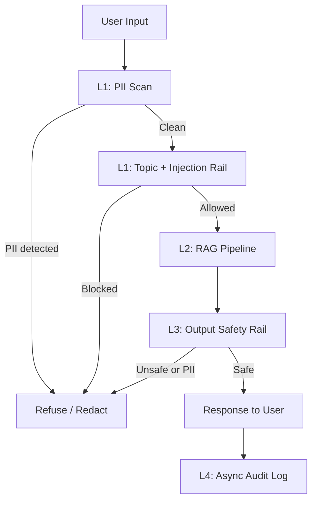

# Production Blueprint: RAG Evaluation & Guardrail Stack

**Sinh viên:** Lưu Xuân Thế  
**MSSV:** 2A202600983  
**Ngày:** 30/06/2026  
**Use case:** HR/Internal policy RAG assistant for Vietnamese company documents

## 1. SLO Definition

| Metric | Target | Alert Threshold | Severity |
|---|---:|---:|---|
| Faithfulness | >= 0.85 | < 0.80 for 30 min | P2 |
| Answer Relevancy | >= 0.80 | < 0.75 for 30 min | P2 |
| Context Precision | >= 0.70 | < 0.65 for 1 hour | P3 |
| Context Recall | >= 0.75 | < 0.70 for 1 hour | P3 |
| Guardrail Adversarial Pass Rate | >= 0.90 | < 0.85 per release | P1 |
| P95 Guard Latency | < 500 ms | > 600 ms for 5 min | P2 |
| PII False Negative Rate | 0% on known PII tests | > 0% | P1 |

## 2. Guard Stack Architecture

Current implementation uses a deterministic offline fallback so it can run without paid APIs:

- PII scan: regex recognizers for email, VN phone, CCCD/CMND.
- Input rail: keyword/rule detector for jailbreak, prompt injection, off-topic, and PII extraction requests.
- RAG baseline: lexical hybrid-style retrieval over `data/*.md`.
- Evaluation: RAGAS-compatible heuristic metrics plus report structure.

## 3. Lab Results

| Item | Result |
|---|---:|
| Test questions | 50 |
| Factual avg score | 0.4443 |
| Multi-hop avg score | 0.4873 |
| Adversarial avg score | 0.4239 |
| Dominant failure distribution | factual |
| Dominant failure metric | context_precision |
| Adversarial guard pass rate | 20/20 |
| Guard P95 latency | 0.03 ms |
| Cohen's kappa sample | 0.000 placeholder/offline |

## 4. Failure Analysis Summary

The main weakness is `context_precision`: the baseline retrieves too many partially related chunks. This is expected because the current fallback uses lexical overlap instead of a production vector index + reranker. Multi-hop questions have slightly better average score because their wording overlaps more with multiple policy documents, but adversarial questions are harder because they involve version conflicts such as v2023 vs v2024.

Recommended fixes:

1. Replace fallback retrieval with the Day 18 hybrid search pipeline.
2. Add metadata filters for effective policy version and document type.
3. Add cross-encoder reranking before answer generation.
4. Log retrieved chunks per query for audit/debugging.

## 5. Alert Playbook

### Incident: Faithfulness drops below 0.80

**Severity:** P2  
**Detection:** Daily/continuous eval alert.  
**Investigation:** Check prompt/model changes, compare latest retrieved chunks, inspect hallucinated examples.  
**Resolution:** Roll back prompt/model if needed, tighten grounding instruction, add citation requirement.

### Incident: Context precision below 0.65

**Severity:** P3  
**Detection:** RAGAS eval gate or dashboard.  
**Investigation:** Inspect top-k retrieved chunks for bottom 10 queries and check stale versions.  
**Resolution:** Add metadata filters, lower top-k before generation, add reranker.

### Incident: Guardrail pass rate below 85%

**Severity:** P1  
**Detection:** CI guardrail suite or production attack sample.  
**Investigation:** Identify missed categories: PII extraction, jailbreak, prompt injection, off-topic.  
**Resolution:** Add rule/recognizer, update adversarial set, rerun latency benchmark.

## 6. Monthly Cost Estimate

Assumption: 100k user queries/month, 1% sampled for eval.

| Component | Unit Cost | Volume | Monthly Cost |
|---|---:|---:|---:|
| RAG generation GPT-4o-mini | $0.001/query | 100k | $100 |
| RAGAS eval sample | $0.01/query | 1k | $10 |
| LLM judge sample | $0.001/query | 10k | $10 |
| PII regex/local guard | $0 | 100k | $0 |
| Llama Guard API/self-host estimate | $0.002/query | 100k | $200 |
| **Total** | | | **$320** |

## 7. CI/CD Gates

Required gates before merge:

- `python3 setup_answers.py`
- `python3 src/phase_a_ragas.py`
- `python3 src/phase_b_judge.py`
- `python3 src/phase_c_guard.py`
- `pytest tests/ -q`
- `python3 check_lab.py`

Quality gates:

- 50 answers generated.
- RAGAS report has `total_questions`, `per_distribution`, `failure_clusters`, `bottom_10`.
- Guardrail pass rate >= 75% minimum; current run: 100%.
- P95 guard latency < 500 ms; current run: 0.03 ms.
